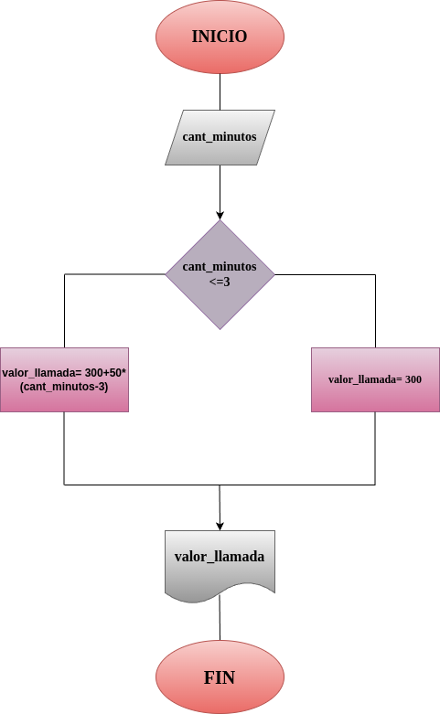

# Programa #3
## Costo de una llamada telefónica

Ingresar el tiempo de duración de una llmada telefónica y determinar la cantidad a pagar, de acuerdo con llo siguiente:

- Toda llamada que dure 3 minutos o menos tiene un costo de 300 pesos.
- Cada minuto adicional cuesta 50 pesos.

# Diseño
